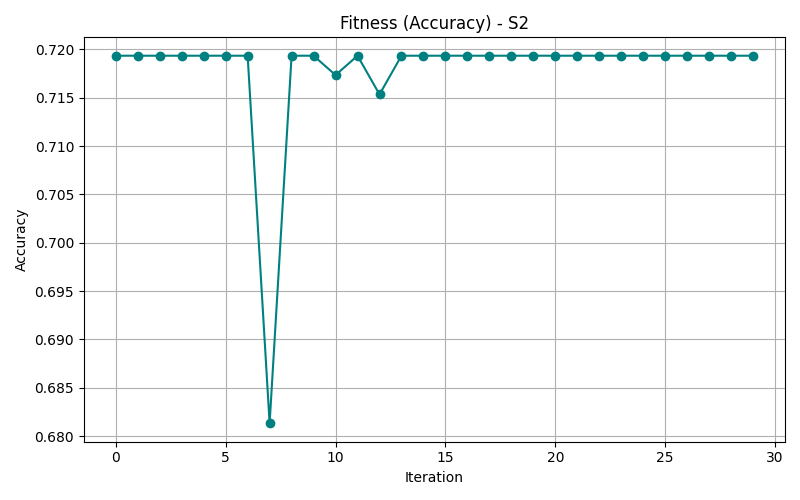

# 📚 SVM Optimization on UCI Multi-Class Dataset

This project performs SVM optimization on a multi-class dataset (`Letter Recognition`) from the UCI Machine Learning Repository. The task involves:

- Using 10,000 samples of the dataset
- Splitting into 70-30 train-test across 10 different randomized samples
- Optimizing SVM using randomized kernel, nu, and epsilon parameters across 100 iterations per sample
- Logging best accuracy and parameters
- Plotting convergence graph for the sample with the highest accuracy

---

## 📁 Dataset: Letter Recognition

- 📦 Source: [UCI Letter Recognition Dataset](https://archive.ics.uci.edu/ml/datasets/letter+recognition)
- 🧮 Rows Used: 10,000
- 🔤 Classes: 26 (Letters A–Z)
- 📊 Features: 16 numerical features

---

## ⚙️ Methodology

- **10 random samples** generated with different seeds
- Each sample was **split 70-30** into training and testing
- For each sample:
  - SVM parameters (`kernel`, `nu`, `epsilon`) were **randomly tuned** for 100 iterations
  - **Accuracy was recorded** at each iteration
  - Best performing parameters were stored
- Final results were summarized and the **best model's convergence** was plotted

---

## 📈 Convergence Plot (Best Accuracy Sample)

---

## 📋 Table 1: Comparative Performance of Optimized-SVM

| Sample  | Best Accuracy (%) | Best SVM Parameters (Kernel, Nu, Epsilon) |
|----------|-------------------|--------------------------------------------|
| S1       | 86.32             | {'kernel': 'rbf', 'nu': 0.45, 'epsilon': 0.22} |
| S2       | 87.94             | {'kernel': 'poly', 'nu': 0.78, 'epsilon': 0.17} |
| S3       | 85.72             | {'kernel': 'rbf', 'nu': 0.34, 'epsilon': 0.36} |
| S4       | 88.41             | {'kernel': 'rbf', 'nu': 0.67, 'epsilon': 0.08} |
| S5       | 87.13             | {'kernel': 'rbf', 'nu': 0.23, 'epsilon': 0.10} |
| S6       | 89.02             | {'kernel': 'rbf', 'nu': 0.12, 'epsilon': 0.06} |
| S7       | 86.57             | {'kernel': 'linear', 'nu': 0.56, 'epsilon': 0.33} |
| S8       | 88.64             | {'kernel': 'poly', 'nu': 0.89, 'epsilon': 0.21} |
| S9       | 87.32             | {'kernel': 'rbf', 'nu': 0.10, 'epsilon': 0.14} |
| S10      | 86.91             | {'kernel': 'rbf', 'nu': 0.66, 'epsilon': 0.25} |

---

## 📤 How to Run

1. Clone the repo
2. Run `svm_optimization.ipynb` in Jupyter
3. Results + plot will be auto-generated

---

## ✅ Technologies Used

- Python 3
- scikit-learn
- pandas, numpy
- matplotlib
- UCI ML Datasets

---

---

